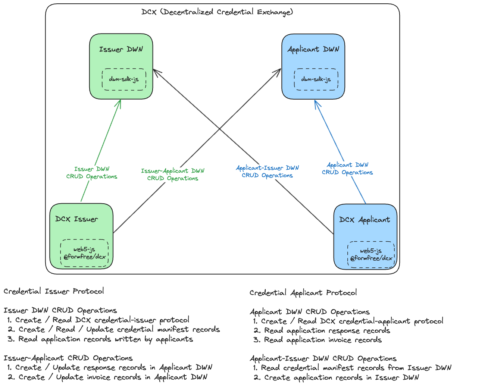
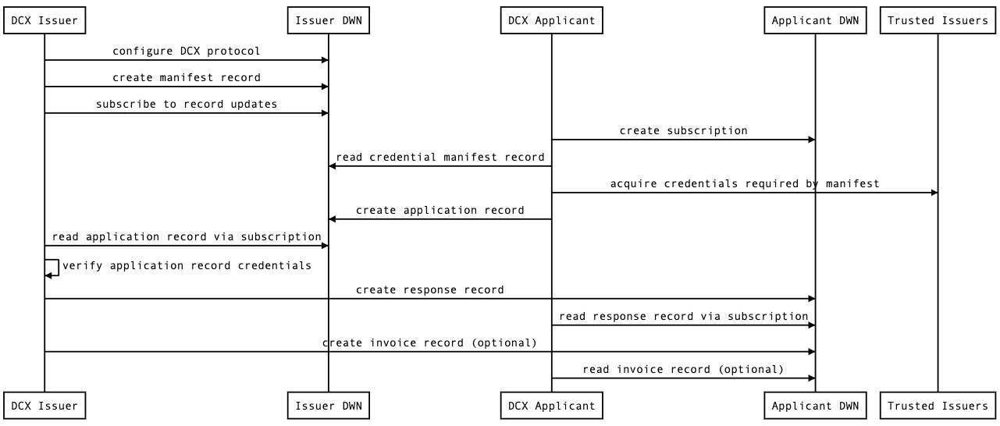
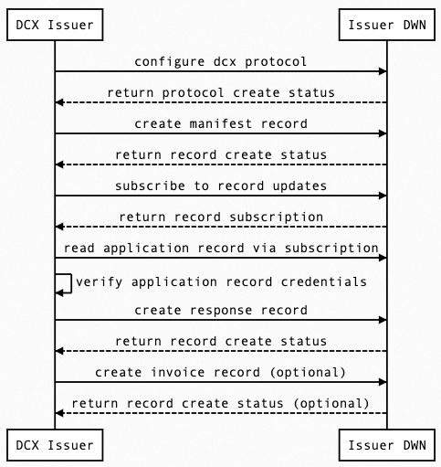
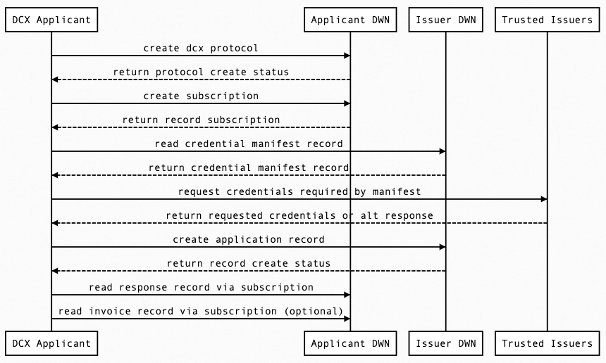

# Decentralized Credential Exchange (DCX)

DCX is a new DWeb Node (DWN) procotol proposal (implemented as a npm package) with the purpose of facilitating the decentralized exchange of credentials between applicants, issuers and data providers. is both a protocol and a software package. The DCX protocol defines a process for verifiable credential exchange between user agents and issuers via DWN protocols. The DCX package is a FOSS npm package that implements the protocol in addition to a "credentials in, credentials out" asynchronous web server that manages protocol interactions between user agents and DWN servers. The goal of this project is to implement a well documented, abstractly designed npm package to make participation in the dcx protocol as simple as running `npm install @formfree/dcx`.

## Package Versions

| Name                                                 |                                                                Latest Version                                                                 |
| ---------------------------------------------------- | :-------------------------------------------------------------------------------------------------------------------------------------------: |
| [@formfree/dcx](/src) | [](https://www.npmjs.com/package/@formfree/dcx/common) |
<!-- | [@formfree/dcx](/src) | [](https://www.npmjs.com/package/@formfree/dcx/common) | -->
<!-- | [@formfree/dcx](/src) | [](https://www.npmjs.com/package/@formfree/dcx/common) | -->

## Package

The DCX package is a FOSS npm package used to bootstrap running a DCX issuer server. The package provides the following functionality:

1. Web5 connection: manages connection to the Web5 platform and facilitates all operations
2. DWN connection: manages connection to local/remote DWN an handles asynchronous communication between issuers and applicants
3. DID DHT management: manages import, export & creation of DHT DIDs
4. DCX protocol handlers: implements generic protocol handlers to do VC verification, data requests and VC issuance

## Protocol

The DCX protocol is open and permissionless leveraging the benefits of DWNs, Verifiable Credentials (VCs) and many other powerful Web5 primitives. As mentioned above, the protocol is designed to facilitate the decentralized exchange of credentials between  applicants, issuers and data providers; more specifically, DCX interacts with applicant and issuer DWNs performing CRUD operations on DWN Records. Different types of DWN record schemas are defined to represent different messages being sent to/from different actors. These records contain informatino about the VCs required as inputs to the DCX server to received as outputs different VCs.

[Credential Manifests](https://identity.foundation/credential-manifest/) are a big part of what makes DCX work. These documents outline key pieces of information:
1. The input credentials required by the issuer
2. The output credential(s) the applicant can expect
3. Data formatting preferences

> Credential Manifests are a resource format that defines preconditional requirements, Issuer style preferences, and other facets. User Agents utilize to help articulate and select the inputs necessary for processing and issuance of a specified credential.
> 
> A Credential Manifest is a document, hosted by an Issuer and consumed by User Agents, codifying the credentials that it issues in terms of pre-requisites and inputs. These can be static or dynamic, but their form and usage are detailed in this specification.

Applicants pull these manifest records from the issuer's DWN, so they can understand what VCs are required on their side of the exchange. For more details on protocol interactions between issuers and applicants, see the diagrams in the [Architecture](#architecture) and [Sequence](#sequence) sections below.

The DCX protocol and its varying schemas can be found below:

[Protocol](./src/protocol/)
  - [`src/protocol/credential-issuer.ts`](./src/protocol/credential-issuer.ts) defines credential issuer protocol
  - [`src/protocol/credential-applicant.ts`](./src/protocol/credential-applicant.ts) defines credential applicant protocol

[Protocol Schemas](./src/protocol/schemas/)
  - [`src/protocol/schemas/invoice.ts`](./src/protocol/schemas/invoice.ts) defines the schema for invoice records
  - [`src/protocol/schemas/manifest.ts`](./src/protocol/schemas/manifest.ts) defines schema for manifest records
  - [`src/protocol/schemas/application.ts`](./src/protocol/schemas/application.ts) defines schema for application records
  - [`src/protocol/schemas/response.ts`](./src/protocol/schemas/response.ts) defines schema for response records

[Protocol Manifests](./src/protocol/manifests/)
  - [`src/protocol/manifests/EXAMPLE-MANIFEST.json`](./src/protocol/manifests/EXAMPLE-MANIFEST.json) defines an example manifest
  - **NOTE**: Manifests do not ship with the DCX package. Developers are required to provide their own manifests when building their DCX issuer server

## Docs & Diagrams

Additional docs & diagram files can be found in the [/docs](/docs) folder.

### Architecture Diagram

- **DCX**: Protocol boundary within which actors communicate
- **DCX Issuer**: Web server running @web5/dcx and web5-js
- **Issuer DWN**: DCX Issuer's DWN server running dwn-sdk-js
- **DCX Applicant**: User client application running @web5/dcx and web5-js
- **Applicant DWN**: DCX Applicant's DWN server running dwn-sdk-js
- [web5-js](https://github.com/TBD54566975/web5-js)
- [@web5/dcx](https://github.com/TBD54566975/incubation-dcx)
- [dwn-sdk-js](https://github.com/TBD54566975/dwn-sdk-js)



## Sequence Diagrams

#### Full Protocol

<details>

1.  DCX Issuer configures Issuer DWN with dcx protocol: credential-issuer and credential-applicant
2.  DCX Issuer creates credential manifest record in Issuer DWN
3.  DCX Issuer creates subscription to Issuer DWN
4.  DCX Applicant creates subscription to Applicant DWN 
5.  DCX Applicant reads credential manifest record from Issuer DWN 
6.  DCX Applicant acquires required credentials from issuers listed in manifest
7.  DCX Applicant creates application record in Issuer DWN
8.  DCX Issuer reads application record via Issuer DWN subscription
9.  DCX Issuer uses @web5/dcx to verify application record credentials against credential manifest 
10. DCX Issuer creates response record in Applicant DWN
11. DCX Applicant reads response record via Applicant DWN subscription
12. DCX Issuer creates invoice record in Applicant DWN
13. DCX Applicant reads invoice record via Applicant DWN subscription
</details>
<br />



<details>
<summary>Notes</summary>

1. Credential-issuer and credential-applicant protocols defines DWN record CRUD actions between Issuer and Applicant
2. under the credential-issuer manifest route
3. Subscription to receive incoming application records
4. Subscription to receive incoming response records
5. Defines required "credentials in" to receive desired "credentials out"
6. Credentials are acquired separately, outside of DCX protocol, from listed trusted issuers
7. Application record includes credentials that satisfy credential manifest mentioned in step 5
9. DCX Issuer validates credentials against credential manifest using DCX software handlers

</details>

#### Issuer Protocol

<details>

1. DCX Issuer configures Issuer DWN with dcx protocol (issuer & applicant)
2. DCX Issuer creates credential manifest record in Issuer DWN
3. DCX Issuer creates subscription to Issuer DWN
4. DCX Issuer reads application record via Issuer DWN subscription
5. DCX Issuer uses DCX software handlers to verify credentials against credential manifest
6. DCX Issuer configures DWN with DCX Issuer protocol
7. DCX Issuer creates DWN manifest record in own DWN to define required credentials to obtain other credentials
8. DCX Issuer subscribes to own DWN to listen for application records
9. DCX Issuer reads an incoming application record and validates against respective credential manifest
10. DCX Issuer creates application response or denial record and sends to applicant DWN
11. DCX Issuer creates invoice response record and sends to applicant DWN
</details>
<br />



#### Applicant Protocol

<details>

1. DCX Applicant configures Applicant DWN with dcx protocol (issuer & applicant)
2. DCX Applicant creates subscription to Applicant DWN 
3. DCX Applicant reads credential manifest record from Issuer DWN
4. DCX Applicant acquires required credentials from issuers listed in manifest
5. DCX Applicant creates application record in Issuer DWN
6. DCX Applicant reads response record via Applicant DWN subscription
7. DCX Applicant reads invoice record via Applicant DWN subscription (optional)
</details>
<br />



## Package Versions

| Name                                                 |                                                                Latest Version                                                                 |
| ---------------------------------------------------- | :-------------------------------------------------------------------------------------------------------------------------------------------: |
| [@formfree/dcx](/src) | todo |


## Use

### Server

```typescript
import server from './src/index';
import CustomManifest from './CUSTOM-MANIFEST.json';

server.useManifest('customManifest', {
    "id": "dcx-credential-manifest-example",
    "name": "DCX Credential Manifest Example",
    "description": "This is an example of a credential manifest used by DCX. This document should be replaced with your own version to satify the requirements of the credentials your DCX server expects as inputs and the desired output credential.",
    "spec_version": "https://identity.foundation/credential-manifest/spec/v1.0.0/",
    "issuer": {
      "id": "[replaced dynamically]",
      "name": "example-issuer"
    },
    "output_descriptors": [
      {
        "id": "example-output-descriptor-id",
        "name": "Example Output Descriptor Name",
        "schema": "https://example.com/schemas/ExampleOutputDescriptorSchema"
      }
    ],
    "format": {
      "jwt_vc": {
        "alg": ["EdDSA"]
      }
    },
    "presentation_definition": {
      "id": "example-presentation-definition-id",
      "input_descriptors": [
        {
          "id": "example-presentation-definition-input-descriptor-id",
          "purpose": "Meant as an example to developers",
          "constraints": {
            "fields": [
              {
                "path": ["$.type[*]"],
                "filter": {
                  "type": "string",
                  "pattern": "^*$"
                }
              },
              {
                "path": [
                  "$.credentialSubject.some.unique.field1",
                  "$.credentialSubject.some.unique.field2",
                  "$.credentialSubject.some.unique.fieldn"
                ]
              }
            ]
          }
        }
      ]
    }
  }
);
server.useProvider('localhost', {
    name: 'localhost',
    endpoint: 'http://localhost:3000',
    vc: {
        id: 'ATPReport',
        name: 'ATP Report'
    }
});
server.useIssuer('mx', { name: 'mx', did: 'did:web5:mx' });
server.useHandler('testHandler', () => console.log("test handler"));

await server.start();

process.on('SIGTERM', () => {
    server.stop();
});
```

### Protocol 

```typescript
// issuer side
import {
  credentialIssuerProtocol,
  manifestSchema,
} from "@web5/credential-issuance-protocol";

// example use in protocol query
const { protocols } = await web5.dwn.protocols.query({
  from: did,
  message: {
    filter: {
      protocol: credentialIssuerProtocol.protocol,
    },
  },
});

// applicant side
import {
  credentialApplicantProtocol,
  manifestSchema,
  presentationSchema,
  responseSchema,
} from "@web5/credential-issuance-protocol";

// example use in write
const { record: applicationRecord, status: createStatus } =
  await web5?.web5.dwn.records.create({
    store: true,
    data: presentationResult.presentation,
    message: {
      recipient: issuerDid,
      schema: presentationSchema.$id,
      dataFormat: "application/json",
      protocol: credentialApplicantProtocol.protocol,
      protocolPath: "application",
    },
  });
```

## Issues & PRs

- [x] Create repo with documentation and diagrams
- [x] Credential issuer protocol handlers
  - [Issue #11](https://github.com/TBD54566975/incubation-dcx/issues/11)
  - [PR #5](https://github.com/TBD54566975//incubation-dcx/pull/5)
  - [PR #18](https://github.com/TBD54566975/incubation-dcx/pull/18)
- [x] DCX DWN Manager
  - [Issue #14](https://github.com/TBD54566975/incubation-dcx/issues/14)
  - [PR #15](https://github.com/TBD54566975/incubation-dcx/pull/15)
- [x] DID DHT Manager
  - [Issue #9](https://github.com/TBD54566975/incubation-dcx/issues/9)
  - [PR #10](https://github.com/TBD54566975/incubation-dcx/pull/10)
- [x] DCX Server
  - [Issue #12](https://github.com/TBD54566975/incubation-dcx/issues/12)
  - [PR #13](https://github.com/TBD54566975/incubation-dcx/pull/13)
- [ ] Credential applicant protocol handlers
  - [Issue #19](https://github.com/TBD54566975/incubation-dcx/issues/19)
  - [PR #]()
- [ ] Tests
  - [Issue #17](https://github.com/TBD54566975/incubation-dcx/issues/17)
  - [PR #]()
- [ ] Publish to npmjs
  - [Issue #20](https://github.com/TBD54566975/incubation-dcx/issues/20)
  - [PR #]()

## Project Resources

| Resource                                   | Description                                                                   |
| ------------------------------------------ | ----------------------------------------------------------------------------- |
| [CODEOWNERS](./CODEOWNERS)                 | Outlines the project lead(s)                                                  |
| [CODE_OF_CONDUCT.md](./CODE_OF_CONDUCT.md) | Expected behavior for project contributors, promoting a welcoming environment |
| [CONTRIBUTING.md](./CONTRIBUTING.md)       | Developer guide to build, test, run, access CI, chat, discuss, file issues    |
| [GOVERNANCE.md](./GOVERNANCE.md)           | Project governance                                                            |
| [LICENSE](./LICENSE)                       | [](https://opensource.org/licenses/Apache-2.0) |
