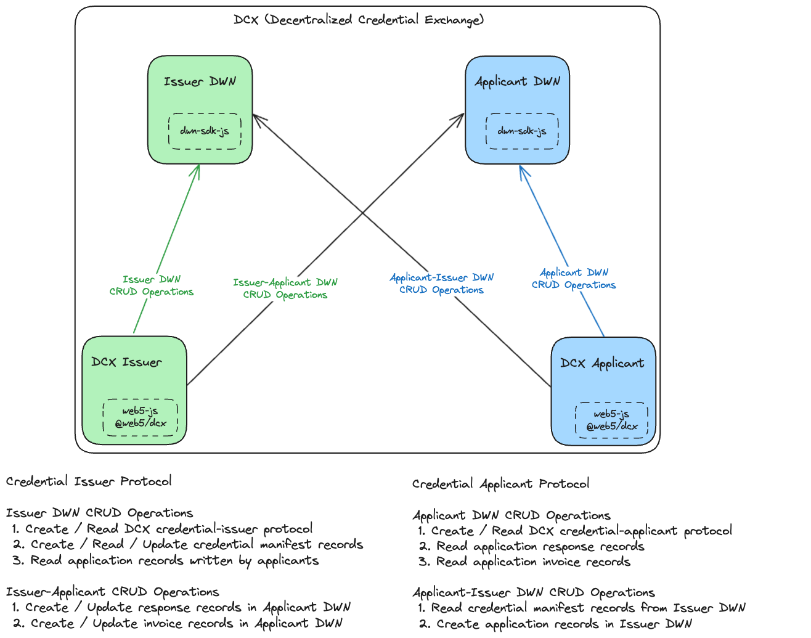

# Decentralized Credential Exchange (DCX)

DCX is both a protocol and a software package. The DCX protocol defines a process for verifiable credential exchange between user agents and issuers via DWN protocols. The DCX package is a FOSS npm package that implements the protocol in addition to a "credentials in, credentials out" asynchronous web server that manages protocol interactions between user agents and DWN servers.

## Goal

Implement a well documented, abstractly designed npm package and merge it into the Web5 monorepo under the name `@web5/dcx`, so developers can `npm install @web5/dcx` into any javascript/typescript project and run a DCX server to participate in the DCX protocol.

## Package

The DCX package is a FOSS npm package used to bootstrap running a DCX issuer server. The package handles the connection between the DCX server and its corresponding DWN server and provides the following functionality:

1. DCX to DWN server connection - asynchronous communication between issuers and applicants
2. DCX to DHT gateway connection - asynchronous communication between issuers and DHT gateways
3. DID DHT key management - import/export/create DID DHT keys
4. DCX protocol & handlers - integrated with api handlers to facilitate required interactions with DWNs and 3rd parties

## Protocol

The DCX protocol is designed as a genearlized credential issuance protocol using [Credential Manifests](https://identity.foundation/credential-manifest/) to define the credentials required to get other credentials. A credential issuer provides one or more manifests defining credentials needed to apply for other credentials. A credential applicant can then send a Credential Application to the issuer providing required credentials and receiving application responses. The issuer can reply with a Credential Response fulfillment including one or more credentials, or a denial including reasons why the credentials were not sufficient. It may also optionally respond with an invoice that must be paid before the request is fulfilled.

- The credential applicant protocol is defined in [`src/protocol/credential-applicant.ts`](./src/protocol/credential-applicant.ts)
- The credential issuer protocol [`src/protocol/credential-issuer.ts`](./src/protocol/credential-issuer.ts)
- The schemas for both protocols are defined in the directory [`src/schemas`](./src/schemas/) 
  - [`src/schemas/invoice.ts`](./src/schemas/invoice.ts) defines the schema for an invoice DWN record
  - [`src/schemas/manifest.ts`](./src/schemas/manifest.ts) defines schema for manifest DWN record
  - [`src/schemas/presentation.ts`](./src/schemas/presentation.ts) defines schema for presentation (application) DWN record
  - [`src/schemas/response.ts`](./src/schemas/response.ts) defined schema for application response DWN record


## Architecture



## Sequence

1. Issuer configures DWN with credential-issuer protocol, creates manifest record DWN and subscribes to DWN
2. Applicant subscribes to DWN, queries issuer DWN for a credential manifest and acquires required credentials
3. Applicant sends application to issuer DWN
4. Issuer reads application from DWN and validates credentials against manifest
5. Issuer sends application response or denial to applicant DWN
6. Applicant reads application response or denial from DWN
7. Issuer sends invoice to applicant DWN
8. Applicant remites payment outside of protocol

**Credential Issuer**

1. Issuer runs @web5/dcx server and configures DWN with issuer protocol
2. Issuer creates DWN manifest record in own DWN to define required credentials to obtain other credentials
3. Issuer subscribes to own DWN to listen for application records
4. Issuer reads an incoming application record and validates against respective credential manifest
5. Issuer creates application response or denial record and sends to applicant DWN
6. Issuer creates invoice response record and sends to applicant DWN

**Credential Applicant**

1. Applicant queries issuer DWN credential manifests and subscribes to own DWN to listen for responses
2. Applicant acquires necessary credentials based on issuer credential manifest
3. Applicant creates application record containing proof of required credentials and sends to issuer DWN
4. Applicant reads application response or denial from issuer retrieving either new credentials or denial reason
5. Applicant reads incoming invoice and remits payment outside of protocol

<!-- TODO: include sequence diagrams -->

## Technical Requirements

- [ ] DID key management (DID DHT)
  - [ ] Read existing keys
  - [ ] Create new keys
  - [ ] Update and delete new/existing keys
- [ ] DHT gateway connection
- [ ] DWN server connection and configuration
- [ ] Credential issuer protocol handlers
  - [ ] Create, read, update credential manifests
  - [ ] Read applications, parse credentials and validate against manifest (presentation exchange)
  - [ ] Request new credentials from trusted 3rd party issuers
  - [ ] Create new credentials from 3rd party data requests
  - [ ] Create and update responses to applications
  - [ ] Create and update invoices as responses to applications

# Use

```javascript
// issuer side
import {
  credentialIssuerProtocol,
  manifestSchema,
} from "@web5/credential-issuance-protocol";

// example use in protocol query
const { protocols } = await web5.dwn.protocols.query({
  from: did,
  message: {
    filter: {
      protocol: credentialIssuerProtocol.protocol,
    },
  },
});

// applicant side
import {
  credentialApplicantProtocol,
  manifestSchema,
  presentationSchema,
  responseSchema,
} from "@web5/credential-issuance-protocol";

// example use in write
const { record: applicationRecord, status: createStatus } =
  await web5?.web5.dwn.records.create({
    store: true,
    data: presentationResult.presentation,
    message: {
      recipient: issuerDid,
      schema: presentationSchema.$id,
      dataFormat: "application/json",
      protocol: credentialApplicantProtocol.protocol,
      protocolPath: "application",
    },
  });
```

## Project Resources

| Resource                                   | Description                                                                   |
| ------------------------------------------ | ----------------------------------------------------------------------------- |
| [CODEOWNERS](./CODEOWNERS)                 | Outlines the project lead(s)                                                  |
| [CODE_OF_CONDUCT.md](./CODE_OF_CONDUCT.md) | Expected behavior for project contributors, promoting a welcoming environment |
| [CONTRIBUTING.md](./CONTRIBUTING.md)       | Developer guide to build, test, run, access CI, chat, discuss, file issues    |
| [GOVERNANCE.md](./GOVERNANCE.md)           | Project governance                                                            |
| [LICENSE](./LICENSE)                       | Apache License, Version 2.0                                                   |
