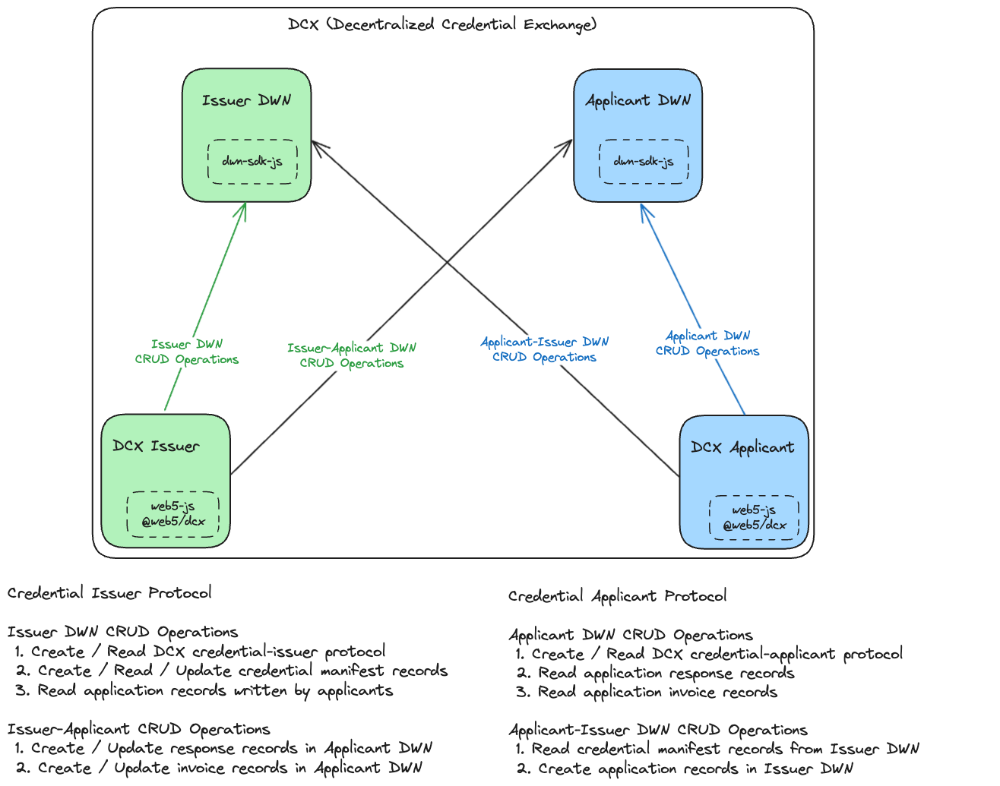
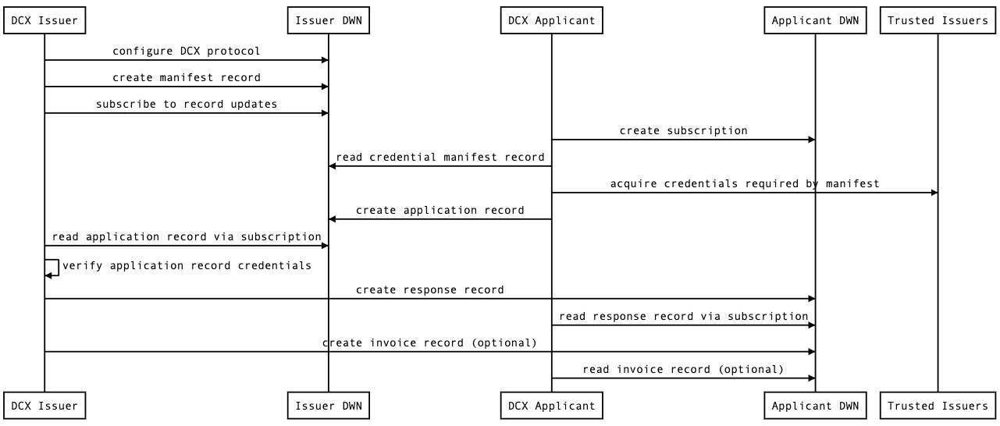
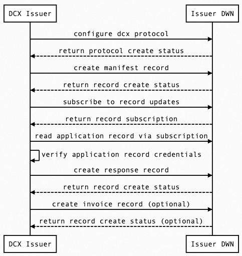
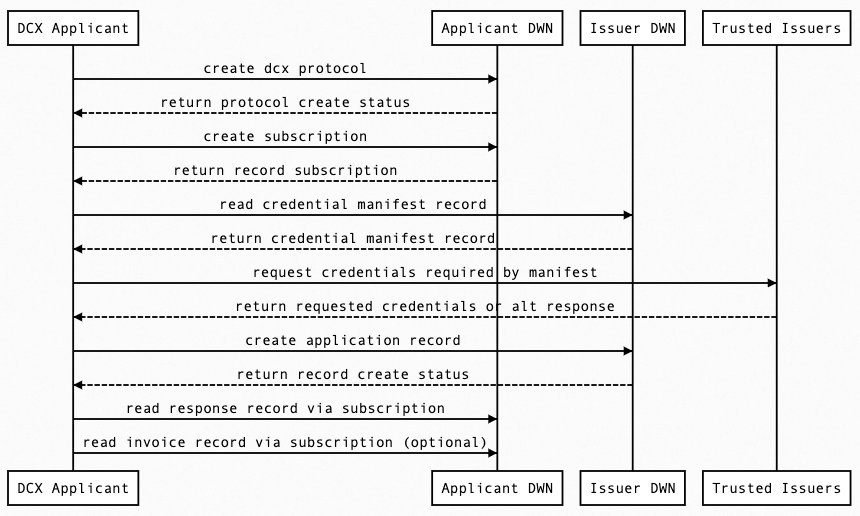

# Decentralized Credential Exchange (DCX)

DCX is both a protocol and a software package. The DCX protocol defines a process for verifiable credential exchange between user agents and issuers via DWN protocols. The DCX package is a FOSS npm package that implements the protocol in addition to a "credentials in, credentials out" asynchronous web server that manages protocol interactions between user agents and DWN servers.

## Goal

Implement a well documented, abstractly designed npm package and merge it into the Web5 monorepo under the name `@web5/dcx`, so developers can `npm install @web5/dcx` into any javascript/typescript project and run a DCX server to participate in the DCX protocol.

## Package

The DCX package is a FOSS npm package used to bootstrap running a DCX issuer server. The package handles the connection between the DCX server and its corresponding DWN server and provides the following functionality:

1. DCX to DWN server connection - asynchronous communication between issuers and applicants
2. DCX to DHT gateway connection - asynchronous communication between issuers and DHT gateways
3. DID DHT key management - import/export/create DID DHT keys
4. DCX protocol & handlers - integrated with api handlers to facilitate required interactions with DWNs and 3rd parties

## Protocol

The DCX protocol is designed as a genearlized credential issuance protocol using [Credential Manifests](https://identity.foundation/credential-manifest/) to define the credentials required to get other credentials. A credential issuer provides one or more manifests defining credentials needed to apply for other credentials. A credential applicant can then send a Credential Application to the issuer providing required credentials and receiving application responses. The issuer can reply with a Credential Response fulfillment including one or more credentials, or a denial including reasons why the credentials were not sufficient. It may also optionally respond with an invoice that must be paid before the request is fulfilled.

- The credential applicant protocol is defined in [`src/protocol/credential-applicant.ts`](./src/protocol/credential-applicant.ts)
- The credential issuer protocol [`src/protocol/credential-issuer.ts`](./src/protocol/credential-issuer.ts)
- The schemas for both protocols are defined in the directory [`src/schemas`](./src/schemas/) 
  - [`src/schemas/invoice.ts`](./src/schemas/invoice.ts) defines the schema for an invoice DWN record
  - [`src/schemas/manifest.ts`](./src/schemas/manifest.ts) defines schema for manifest DWN record
  - [`src/schemas/presentation.ts`](./src/schemas/presentation.ts) defines schema for presentation (application) DWN record
  - [`src/schemas/response.ts`](./src/schemas/response.ts) defined schema for application response DWN record


## Architecture



- DCX
- DCX Issuer
  - web5-js
  - @web5/dcx
- Issuer DWN
  - dwn-sdk-js
- DCX Applicant
  - web5-js
  - @web5/dcx
- Applicant DWN
  - dwn-sdk-js

## Full Sequence

<!--
DCX Issuer->Issuer DWN: configure dcx protocol
DCX Issuer->Issuer DWN: create manifest record
DCX Issuer->Issuer DWN: subscribe to record updates
DCX Applicant->Applicant DWN: configure dcx protocol
DCX Applicant->Applicant DWN: create subscription
DCX Applicant->Issuer DWN: read manifest record
DCX Applicant->Trusted Issuers: acquire credentials required by manifest
DCX Applicant->Issuer DWN: create application record
DCX Issuer->Issuer DWN: read application record via subscription
DCX Issuer->DCX Issuer: verify application record credentials
DCX Issuer->Applicant DWN: create application response record
DCX Applicant->Applicant DWN: read response record via subscription
DCX Issuer->Applicant DWN: create invoice record (optional)
DCX Applicant->Applicant DWN: read invoice record  (optional)
-->



1.  DCX Issuer configures Issuer DWN with dcx protocol: credential-issuer and credential-applicant
2.  DCX Issuer creates credential manifest record in Issuer DWN
3.  DCX Issuer creates subscription to Issuer DWN
4.  DCX Applicant creates subscription to Applicant DWN 
5.  DCX Applicant reads credential manifest record from Issuer DWN 
6.  DCX Applicant acquires required credentials from issuers listed in manifest
7.  DCX Applicant creates application record in Issuer DWN
8.  DCX Issuer reads application record via Issuer DWN subscription
9.  DCX Issuer uses @web5/dcx to verify application record credentials against credential manifest 
10. DCX Issuer creates response record in Applicant DWN
11. DCX Applicant reads response record via Applicant DWN subscription
12. DCX Issuer creates invoice record in Applicant DWN
13. DCX Applicant reads invoice record via Applicant DWN subscription

Notes:

1. Credential-issuer and credential-applicant protocols defines DWN record CRUD actions between Issuer and Applicant
2. under the credential-issuer manifest route
3. Subscription to receive incoming application records
4. Subscription to receive incoming response records
5. Defines required "credentials in" to receive desired "credentials out"
6. Credentials are acquired separately, outside of DCX protocol, from listed trusted issuers
7. Application record includes credentials that satisfy credential manifest mentioned in step 5
9. DCX Issuer validates credentials against credential manifest using DCX software handlers

## Credential Issuer Sequence
<!--
DCX Issuer->Issuer DWN: configure dcx protocol
Issuer DWN\-\->DCX Issuer: return protocol create status
DCX Issuer->Issuer DWN: create manifest record
Issuer DWN\-\->DCX Issuer: return record create status
DCX Issuer->Issuer DWN: subscribe to record updates
Issuer DWN\-\->DCX Issuer: return record subscription
DCX Issuer->Issuer DWN: read application record via subscription
DCX Issuer->DCX Issuer: verify application record credentials 
DCX Issuer->Issuer DWN: create response record
Issuer DWN\-\->DCX Issuer: return record create status
DCX Issuer->Issuer DWN: create invoice record (optional)
Issuer DWN\-\->DCX Issuer: return record create status (optional)
-->



1. DCX Issuer configures Issuer DWN with dcx protocol (issuer & applicant)
2. DCX Issuer creates credential manifest record in Issuer DWN
3. DCX Issuer creates subscription to Issuer DWN
4. DCX Issuer reads application record via Issuer DWN subscription
5. DCX Issuer uses DCX software handlers to verify credentials against credential manifest
6. DCX Issuer configures DWN with DCX Issuer protocol
7. DCX Issuer creates DWN manifest record in own DWN to define required credentials to obtain other credentials
8. DCX Issuer subscribes to own DWN to listen for application records
9. DCX Issuer reads an incoming application record and validates against respective credential manifest
10. DCX Issuer creates application response or denial record and sends to applicant DWN
11. DCX Issuer creates invoice response record and sends to applicant DWN

## Credential Applicant Sequence
<!--
DCX Applicant->Applicant DWN: create dcx protocol
Applicant DWN\-\->DCX Applicant: return protocol create status
DCX Applicant->Applicant DWN: create subscription
Applicant DWN\-\->DCX Applicant: return record subscription
DCX Applicant->Issuer DWN: read credential manifest record
Issuer DWN\-\->DCX Applicant: return credential manifest record
DCX Applicant->Trusted Issuers: request credentials required by manifest
Trusted Issuers\-\->DCX Applicant: return requested credentials or alt response
DCX Applicant->Issuer DWN: create application record
Issuer DWN\-\->DCX Applicant: return record create status
DCX Applicant->Applicant DWN: read response record via subscription
DCX Applicant->Applicant DWN: read invoice record via subscription (optional)
-->



1. DCX Applicant configures Applicant DWN with dcx protocol (issuer & applicant)
1. DCX Applicant creates subscription to Applicant DWN 
2. DCX Applicant reads credential manifest record from Issuer DWN
3. DCX Applicant acquires required credentials from issuers listed in manifest
4. DCX Applicant creates application record in Issuer DWN
5. DCX Applicant reads response record via Applicant DWN subscription
6. DCX Applicant reads invoice record via Applicant DWN subscription (optional)


## TODO

- [x] Create repo with documentation
- [ ] Credential issuer protocol handlers
  - [ ] Create, read, update credential manifests
  - [ ] Read applications, parse credentials and validate against manifest (presentation exchange)
  - [ ] Request new credentials from trusted 3rd party issuers
  - [ ] Create new credentials from 3rd party data requests
  - [ ] Create and update responses to applications
  - [ ] Create and update invoices as responses to applications
- [ ] DID key management (DID DHT)
  - [ ] Read existing keys
  - [ ] Create new keys
  - [ ] Update and delete new/existing keys
- [ ] DHT gateway connection
- [ ] DWN server connection and configuration

# Use

```javascript
// issuer side
import {
  credentialIssuerProtocol,
  manifestSchema,
} from "@web5/credential-issuance-protocol";

// example use in protocol query
const { protocols } = await web5.dwn.protocols.query({
  from: did,
  message: {
    filter: {
      protocol: credentialIssuerProtocol.protocol,
    },
  },
});

// applicant side
import {
  credentialApplicantProtocol,
  manifestSchema,
  presentationSchema,
  responseSchema,
} from "@web5/credential-issuance-protocol";

// example use in write
const { record: applicationRecord, status: createStatus } =
  await web5?.web5.dwn.records.create({
    store: true,
    data: presentationResult.presentation,
    message: {
      recipient: issuerDid,
      schema: presentationSchema.$id,
      dataFormat: "application/json",
      protocol: credentialApplicantProtocol.protocol,
      protocolPath: "application",
    },
  });
```

## Project Resources

| Resource                                   | Description                                                                   |
| ------------------------------------------ | ----------------------------------------------------------------------------- |
| [CODEOWNERS](./CODEOWNERS)                 | Outlines the project lead(s)                                                  |
| [CODE_OF_CONDUCT.md](./CODE_OF_CONDUCT.md) | Expected behavior for project contributors, promoting a welcoming environment |
| [CONTRIBUTING.md](./CONTRIBUTING.md)       | Developer guide to build, test, run, access CI, chat, discuss, file issues    |
| [GOVERNANCE.md](./GOVERNANCE.md)           | Project governance                                                            |
| [LICENSE](./LICENSE)                       | Apache License, Version 2.0                                                   |
